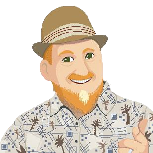
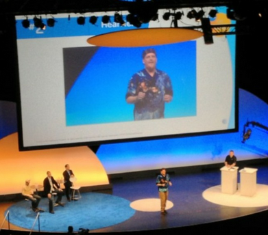

# MarkDav.is

Welcome to my business card!  I'm glad you're here! 🎉

I'm obsessed with collaboration.  The more folks on a project the better. We all learn from each other to bring the awesome.

If you want to connect, the best way is to chat me up in [The Slack](http://eugenetech.slack.com) or maybe use [The Switchboard](http://eugenetech.switchboardhq.com) or scan the official cred on [The LinkedIn](https://www.linkedin.com/in/markdavs/). I'm more active on 
social media via [The Instagram](http://instagram.com/markedavis) or [The Facebook](https://www.facebook.com/MarkTheDavis) or [The Twitter](https://twitter.com/nohorse) or [The Tumblr](https://markdav-is.tumblr.com/). So many ways to collaborate.

My professional path follows a few tracks.  
- On one hand, I’m an software engineer.  I’ve been programming my whole life and a full-stack developer for over a decade. Today I focus on cloud and mobile. My strongest platform is .Net and my fav language is C#.
- On the other hand, I’m a Mozilla Open Leader and Innersource Evangelist.  

Below are links to two resumes depending on what facets you’d like to leverage.  I also dabble in things like [hackathons](http://openeugenefest.org) and [large scale art projects](http://king-pong.com)

This page was last updated in the Fall of 2019.  I’m currently contracting thru [Dark Matter](http://darkmatter.consulting) and managing a [coworking space](http://codechops.com).  I built this page to [match](http://markdav.is) my IRL business cards.

### [Resume (leadership focus)](MED-Resume-2018-Open-Leader.pdf)

### [Resume (developer focus)](https://github.com/nohorse/markdav-is/blob/master/docs/MED%20Resume%202019%20Dev.pdf)

Here's a photo of me presenting at an [AT&T developers conference](https://www.youtube.com/watch?feature=player_detailpage&v=rwDRFM2hcsY&t=314) a few years ago.

